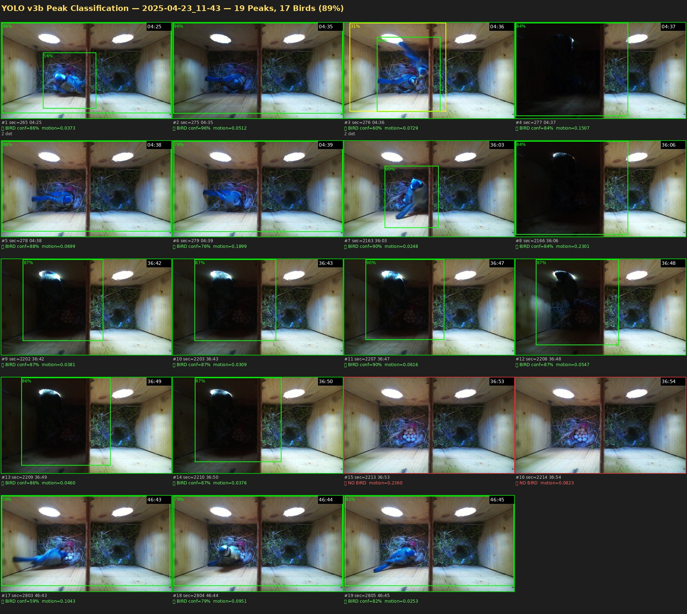
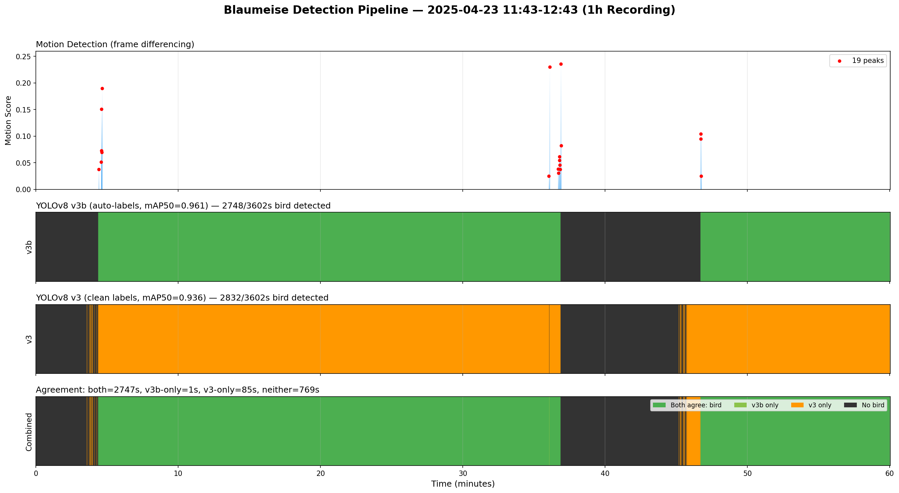
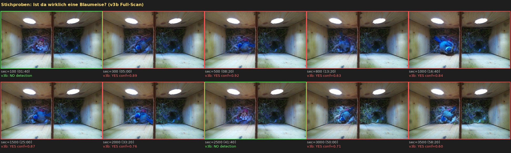

# Video Analysis: 2025-04-23 11:43–12:43

One-hour recording from the nesting box camera (vogl-cam, Pi 4, IMX708 Wide, top-down view).
This document compares three detection methods on the same video and validates the YOLO v3b model
despite its known bounding-box issues.

## Recording Details

| Property | Value |
|----------|-------|
| Date | 2025-04-23 |
| Time | 11:43–12:43 UTC |
| Camera | vogl-cam (Pi 4, IMX708 Wide) |
| Resolution | 1920×1080 @ 30 fps |
| Duration | 60 min (108,060 frames) |
| File | `2025-04-23_11-43-25-573500.mp4` |

## Method 1: Motion Detection (Frame Differencing)

The GPU-accelerated motion detection pipeline (`scripts/motion-detect-gpu.py`) found
**19 motion peaks** in this recording — moments where significant pixel change occurred
between consecutive frames.

These peaks cluster into **3 visits**:

| Cluster | Time | Peaks | Top Score |
|---------|------|-------|-----------|
| 1 | 04:25–04:39 | 6 | 0.190 |
| 2 | 36:03–36:54 | 11 | 0.236 |
| 3 | 46:43–46:45 | 3 | 0.104 |

Motion detection captures **transitions** — the bird arriving or leaving — but cannot
determine whether the bird is present between peaks.

## Method 2: YOLO v3b (Auto-labeled, 1267 images, mAP50=0.961)

Full-video scan at 1 frame per second (3,602 samples), conf≥0.25:

- **2,748 / 3,602 seconds** with blue tit detected (76.3%)
- Scan time: 217s on RTX 3050 (17 samples/s)

### Peak Classification

Running v3b on the 19 motion-peak frames:

- **17/19 peaks** correctly identified as blue tit (89%)
- 2 misses at sec 2213–2214 (36:53–36:54): bird had just departed, residual motion detected
- Confidence range: 0.56–0.96



### Known Issue: Oversized Bounding Boxes

The v3b model frequently produces **full-frame bounding boxes** (~1920×1024) instead of
tight boxes around the bird. This is an artifact of the auto-labeling pipeline used for
v3b training: the 1,000 bootstrap frames were auto-labeled by the v2 model, which had
the same oversized-bbox tendency due to circular validation.

**Impact:** Localization is unreliable, but **presence detection is correct** — verified
by manual inspection (see below).

## Method 3: YOLO v3 (Clean labels, 267 images, mAP50=0.936)

Same full-video scan, conf≥0.25:

- **2,832 / 3,602 seconds** with blue tit detected (78.6%)
- Scan time: 216s on RTX 3050

## Comparison

| Metric | v3b | v3 |
|--------|-----|-----|
| Training images | 1,267 (267 clean + 1,000 auto) | 267 (all clean) |
| mAP50 | 0.961 | 0.936 |
| Seconds with bird | 2,748 (76.3%) | 2,832 (78.6%) |
| Agreement | **97.6%** (only 86s differ) |



### Agreement Breakdown

| Category | Seconds | % |
|----------|---------|---|
| Both agree: bird present | 2,747 | 76.3% |
| Both agree: no bird | 769 | 21.3% |
| v3b only | 1 | 0.0% |
| v3 only | 85 | 2.4% |

## Manual Verification

10 random frames were inspected using a vision model to check for false positives.
Initial assumption was that v3b's 76% detection rate was dominated by false positives —
this turned out to be wrong.



**Result: 8/10 frames genuinely show a blue tit** sitting on eggs. Only sec=100 (01:40)
and sec=2500 (41:40) were truly empty — matching both v3 and v3b predictions exactly.

The bird was **incubating** for most of the recording, sitting motionless on the nest.
This explains why motion detection only fires during arrivals/departures while YOLO
detects continuous presence.

## Key Insights

1. **Motion detection and YOLO are complementary:**
   - Motion peaks → *"when does something happen?"* (transitions)
   - YOLO full-scan → *"is anyone home?"* (presence)

2. **v3b works for presence detection** despite bounding box issues. For
   localization/tracking, a clean v3c model with manually verified tight bounding
   boxes would be needed.

3. **v3 and v3b agree 97.6%** — the auto-labeled bootstrap data didn't hurt
   classification accuracy, only bbox quality.

4. **Breeding behavior confirmed:** Blue tit incubating eggs, present ~76% of the
   time with short foraging breaks (~24% absence).

## Pipeline Usage

The classification pipeline (`scripts/analyse/classify_peaks.py`) takes a video file,
motion peaks CSV, and a YOLO model, and outputs per-peak bird/no-bird classification:

```bash
source ~/vogelhaus/venv/bin/activate
python scripts/analyse/classify_peaks.py \
    path/to/video.mp4 \
    --model runs/detect/training/blaumeise_v3b/weights/best.pt \
    --conf 0.25 \
    --output results.csv
```

Environment variables for portability:
- `VOGELHAUS_ANALYSE_DIR` — base dir for analysis results (default: `~/vogelhaus/analyse`)
- `VOGELHAUS_MODEL` — path to YOLO model weights

## Model Comparison (All Versions)

| Model | Images | Labels | mAP50 | mAP50-95 | Precision | Recall | Bbox Quality |
|-------|--------|--------|-------|----------|-----------|--------|-------------|
| v1 | 43 | manual | 0.599 | 0.222 | — | — | unknown |
| v2 | 211 | auto (v1) | 0.990* | 0.816 | 0.982 | 0.933 | oversized |
| v3 | 267 | clean | 0.936 | 0.750 | 0.874 | 0.898 | good |
| v3b | 1,267 | clean+auto | 0.961 | 0.906 | 0.900 | 0.893 | oversized |

\* v2's 0.990 was inflated by circular validation (auto-labels validated against the same model).

## Next Steps

- [ ] Train v3c with clean, tight bounding boxes for proper localization
- [ ] Run full NAS backlog (660h) through motion + YOLO pipeline
- [ ] Generate highlight clips for confirmed bird visits
